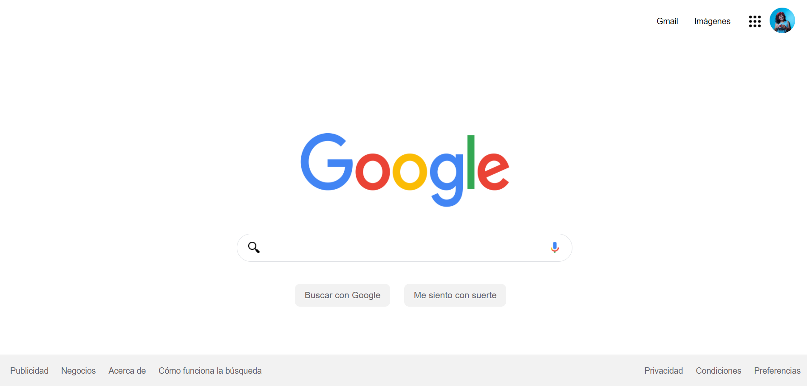

# Clonación de la Interfaz de Google con HTML y CSS

Hola, este es el proyecto final que realice en el curso de Tecnolochicas❤:

## 1. Intro

## 2. Demo

Puedes entrar a ver el demo en este vínculo: https://berenisecenteno.github.io/Google-Clone/

La idea es inspirarte con esta demostración de proyecto. 

**¡Quizá no te quede idéntico o quizá te quede mucho mejor que este demo🤩**, utiliza tu destreza y aprendizaje para que demuestres que tu futuro es ser un(a) programador(a) web.👩🏻💻👦🏻

Happy coding!❤

